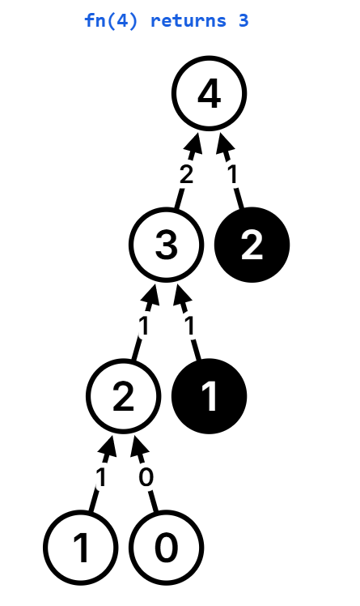

# Recursion

### What is Recursion?
Recursion is a process where a function calls itself to solve a problem by breaking it down into smaller, similar problems until reaching a stopping point, known as the base case.

Recursion is a programming technique in which a function calls itself to solve a problem. The function typically breaks down a complex problem into simpler instances of the same problem, solving each until it reaches a base case that does not involve further recursion. Recursion is commonly used in problems involving tasks that can be divided into similar sub-tasks, such as tree traversal, factorial calculation, and sorting algorithms like quicksort and mergesort.

### A recursive function generally has two main parts:
1. **Base Case**: A condition where the function stops calling itself to prevent an infinite loop.
2. **Recursive Case**: The part where the function calls itself with modified parameters, moving toward the base case.

Here's a basic example using recursion to calculate the factorial of a number \( n \):

```python
def factorial(n):
    if n == 0:
        return 1  # Base case
    return n * factorial(n - 1)  # Recursive case
```

In this example, `factorial` calls itself with `n - 1` until it reaches `n == 0`, where it returns 1, thereby stopping further recursive calls.

### Stack Overflow
In recursion, **stack overflow** occurs when a function calls itself so many times that it exceeds the maximum stack space, which is the memory allocated for function calls. Each recursive call adds a new "frame" to the stack, holding the function's parameters and local variables. If recursion goes too deep without reaching a base case (for example, in infinite or very deep recursion), the stack runs out of space, causing a stack overflow error.

### Example
If a recursive function doesn’t have a proper base case or calls itself too many times:

```python
def infinite_recursion():
    return infinite_recursion()  # No base case, leads to stack overflow

infinite_recursion()
```

### Avoiding Stack Overflow
1. **Define a base case**: Ensure there’s a condition where the function stops calling itself.
2. **Optimize recursion depth**: Use tail recursion where possible, or convert to an iterative approach if stack depth is an issue.


### Recursion Tree
A **recursion tree** is a visual representation of the recursive calls made by a function. It shows how a problem is broken down into sub-problems by a recursive function and helps to visualize the call flow, especially with complex recursive problems. Each level of the tree represents a deeper level of recursion, and each node represents a function call with specific parameters.

### Example of a Recursion Tree for Fibonacci
Consider the Fibonacci sequence, where `F(n) = F(n-1) + F(n-2)`:

```python
def fibonacci(n):
    if n <= 1:
        return n
    return fibonacci(n - 1) + fibonacci(n - 2)
```

If we call `fibonacci(4)`, the recursion tree looks like this:



### Key Points
1. **Root Node**: Represents the initial call (e.g., `fibonacci(4)`).
2. **Branches**: Show the function calls made by each recursive step.
3. **Leaf Nodes**: Nodes where the recursion ends, reaching the base case (e.g., `fibonacci(1)` or `fibonacci(0)`).

A recursion tree helps in analyzing the time complexity and understanding the overlapping sub-problems, as seen with Fibonacci, where calls like `fibonacci(2)` are repeated.