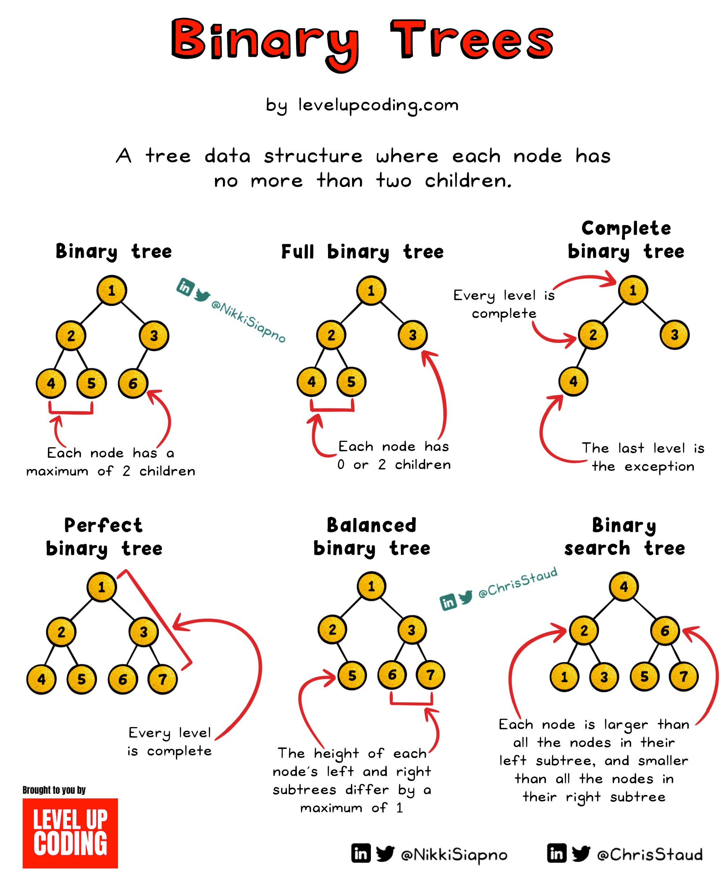

### 1. **Binary Tree (BT) Overview**
### What is a Binary Tree?

A **binary tree** is a hierarchical data structure in which each node has at most two children, referred to as the **left child** and the **right child**. It's a specialized type of tree that structures data efficiently, making certain operations (like search, insertion, and deletion) more straightforward and faster compared to linear data structures like arrays or linked lists.

### Key Characteristics:
1. **Nodes**: Individual elements in the tree.
2. **Edges**: Links between parent and child nodes.
3. **Root**: The topmost node in the tree.
4. **Height**: Longest path from the root to any leaf node.
5. **Leaf Nodes**: Nodes without children.
6. **Internal Nodes**: Nodes with at least one child.

### Basic Structure of a Node in Binary Tree
```python
class Node:
    def __init__(self, data):
        self.data = data
        self.left = None
        self.right = None
```
---

### 2. Why Use a Binary Tree?

1. **Efficient Searching and Sorting**:
   - Compared to an unsorted list, binary trees (especially **binary search trees**) allow for much faster search operations (O(log n) in balanced trees).
   
2. **Dynamic Data Storage**:
   - Unlike arrays, binary trees don’t need a fixed size and can dynamically adjust as elements are added or removed.

3. **Hierarchical Data Representation**:
   - Suitable for representing hierarchical relationships like organizational structures, file systems, and decision trees.

4. **Facilitates Complex Algorithms**:
   - Many algorithms use binary trees as their foundation, such as **Huffman encoding**, **expression parsing**, and **game decision trees**.

---

### Real-World Examples of Binary Trees:

1. **File Systems**:
   - Directory structures are often represented as trees. Each folder can contain subfolders or files, similar to a binary tree where each folder can be viewed as a node with child nodes.

2. **Decision Trees in AI**:
   - Used in machine learning models for decision-making processes, where each internal node represents a decision, and leaf nodes represent outcomes.

3. **Expression Parsing**:
   - Mathematical expressions (e.g., \( (a + b) * c \)) are stored as binary expression trees where operators are internal nodes, and operands are leaf nodes.

4. **Routing Tables**:
   - Binary trees are used in network routers to store routing tables for efficient pathfinding.

5. **Gaming**:
   - AI in games uses binary decision trees to decide the next move based on the current game state.

---

### Why Go for Binary Tree Instead of Other Data Structures?

1. **Compared to Arrays**:
   - Arrays have a fixed size and require shifting elements for insertion/deletion, leading to O(n) complexity.
   - Binary trees can dynamically grow and shrink and allow O(log n) operations in balanced trees.

2. **Compared to Linked Lists**:
   - Linked lists offer O(n) time for search operations.
   - Binary trees can reduce this to O(log n) in balanced scenarios.

3. **Compared to Hash Tables**:
   - While hash tables provide O(1) average search time, they lack inherent ordering.
   - Binary Search Trees maintain order and allow operations like finding min/max or successor/predecessor efficiently.

---

### Advantages of Binary Trees:
1. **Fast Data Access**: O(log n) in balanced binary trees.
2. **Flexible Size**: Unlike arrays, binary trees don’t need predefined size.
3. **Maintains Order**: In BSTs, data is kept sorted.
4. **Foundation for Advanced Trees**: AVL trees, Red-Black trees, and B-trees all extend binary trees.

---

### 3. **How to Solve Problems with BT/BST?**
   - Use recursive or iterative traversals (Inorder, Preorder, Postorder, Level Order).
   - Apply divide-and-conquer principles for problem-solving.

---

### 4. **Difference Between BT and BST**

| **Binary Tree (BT)**           | **Binary Search Tree (BST)**       |
|---------------------------------|-------------------------------------|
| No specific order of elements.  | Left child < Parent < Right child  |
| Can be any shape.               | Maintains sorted structure.        |
| All nodes can have 0, 1, or 2 children. | Left subtree values < root, right subtree values > root. |
| Used for general purposes.      | Used for searching, sorting.        |

---

### 5. **Properties and Terms**
- **Height of a Tree**: Longest path from root to leaf.
- **Depth**: Distance from root to a node.
- **Leaf Node**: Node with no children.
- **Internal Node**: Node with at least one child.
  
---

### 6. **Types of Binary Trees**
1. **Full Binary Tree**: Every node has 0 or 2 children.
2. **Complete Binary Tree**: All levels are filled except possibly the last.
3. **Perfect Binary Tree**: All internal nodes have two children, and all leaves are at the same level.
4. **Skewed Binary Tree**: All nodes have only one child (left or right).
5. **Balanced Binary Tree**: The height difference between left and right subtrees is at most 1.

---

### 7. **Formulas**
- **Height of Perfect BT**:  
  ( h = \log_2(n+1) - 1 )
  
- **Total Nodes in Perfect BT**:  
  ( n = 2^{h+1} - 1 )

- **Number of Leaf Nodes**:  
  ( L = frac{n + 1}{2} )

- **Number of Internal Nodes**:  
  ( I = n - L )

- **Strict Binary Tree**:  
  ( n = 2I + 1 )

---

### 8. **Time and Space Complexity**
| **Operation**      | **Average Time** | **Worst Time** | **Space Complexity** |
|---------------------|-------------------|----------------|-----------------------|
| Search (BST)        | ( O(log n) )   | ( O(n) )     | ( O(n) )            |
| Insert/Delete (BST) | ( O(log n) )   | ( O(n) )     | ( O(n) )            |
| Traversal (BT)      | ( O(n) )        | ( O(n) )     | ( O(h) )            |

---

### Expanded Properties and Terms of a Binary Tree:

#### 1. **Size**:
   - **Definition**: The total number of nodes in the tree.
   - **Formula**:  
    Size=Total number of nodes=Internal nodes+Leaf nodes

#### 2. **Parent**:
   - **Definition**: A node is a **parent** if it has one or more child nodes.
   - **Example**: In a tree, for node \(A\) and \(B\), if \(A\) is directly above \(B\), \(A\) is the parent of \(B\).

#### 3. **Leaf**:
   - **Definition**: A node with no children.
   - **Example**: In a binary tree, nodes at the bottom-most level without any connections to further nodes.

#### 4. **Level**:
   - **Definition**: The depth of a node in the tree, starting from the root as Level 0.
   - **Formula**:  
     For a node at height \(h\), its level is \(L = h\).

#### 5. **Height**:
   - **Definition**: The number of edges in the longest path from a node to a leaf.
   - **Formula**:  
     Height of tree=max depth from root to leaf.

#### 6. **Edges**:
   - **Definition**: Connections between two nodes.
   - **Formula**:  
     Edges=Number of nodes−1 (for connected trees).

#### 7. **Subtree**:
   - **Definition**: A subtree is a smaller part of a tree, consisting of a node and all its descendants.
   - **Example**: Every node in a binary tree can act as a root of its own subtree.

#### 8. **Ancestor**:
   - **Definition**: A node is an ancestor of another node if it lies on the path from the root to that node.
   - **Example**: In a tree, if \(A\) lies on the path from root to \(D\), \(A\) is an ancestor of \(D\).

#### 9. **Descendant**:
   - **Definition**: A node \(X\) is a descendant of node \(Y\) if \(X\) is located in the subtree rooted at \(Y\).
   - **Example**: Node \(C\) is a descendant of node \(A\).

#### 10. **Child**:
   - **Definition**: A node directly connected below another node.
   - **Example**: If \(A\) is the parent, \(B\) is the child.

#### 11. **Sibling**:
   - **Definition**: Nodes that share the same parent.
   - **Example**: If nodes \(B\) and \(C\) have the same parent \(A\), they are siblings.

---

### Comparison of Different Types of Trees

Below is a detailed comparison of various types of trees based on their structure, properties, and common use cases.

---

| **Tree Type**            | **Structure**                                                                 | **Properties**                                                                                                           | **Common Use Cases**                                         |
|---------------------------|------------------------------------------------------------------------------|-------------------------------------------------------------------------------------------------------------------------|--------------------------------------------------------------|
| **Binary Tree (BT)**      | Each node has at most 2 children.                                             | No specific structure or order.                                                                                         | General hierarchical data, expression trees.                 |
| **Full Binary Tree**      | Every node has 0 or 2 children.                                               | All nodes have either 0 or 2 children.                                                                                  | Decision trees, heap implementation.                         |
| **Complete Binary Tree**  | All levels except possibly the last are fully filled, and nodes are as left as possible. | Height is \( O(\log n) \).                                                                                              | Binary heaps (used in heapsort, priority queues).            |
| **Perfect Binary Tree**   | All internal nodes have 2 children, and all leaves are at the same level.     | Total nodes \( n = 2^{h+1} - 1 \), height \( h = \log_2(n+1) - 1 \).                                                     | Efficient memory utilization in indexing.                    |
| **Skewed Binary Tree**    | All nodes have only one child (left or right).                                | Worst-case height is \( O(n) \).                                                                                        | Simulates linked list behavior; occurs in unbalanced cases.  |
| **Balanced Binary Tree**  | Difference between heights of left and right subtrees is at most 1 for every node. | Search, insert, delete in \( O(\log n) \).                                                                              | AVL trees, Red-Black trees for efficient dynamic operations. |
| **Binary Search Tree (BST)** | Left subtree < root < right subtree (all values).                           | Search, insert, delete in \( O(\log n) \) if balanced; \( O(n) \) in worst case.                                         | Searching, dynamic sets, database indexing.                  |
| **AVL Tree**              | A self-balancing binary search tree.                                          | Balance factor \( |h_\text{left} - h_\text{right}| \leq 1 \) for all nodes.                                             | Faster search, insert, delete than unbalanced BSTs.          |
| **Red-Black Tree**        | A self-balancing BST with additional color property.                          | Maintains balance through recoloring and rotations; height \( O(\log n) \).                                             | Used in libraries like STL (C++), TreeMap (Java).            |
| **Trie (Prefix Tree)**    | Each node represents a character; children represent possible next characters. | Used for strings; searching for prefixes is efficient.                                                                  | Autocomplete, dictionary word searches.                      |
| **Heap (Min/Max)**        | A complete binary tree where root is the minimum/maximum.                     | Heap property: \( A[parent] \leq A[child] \) (Min-Heap) or \( A[parent] \geq A[child] \) (Max-Heap).                     | Priority queues, heapsort.                                   |
| **B-Tree**                | A self-balancing search tree for sorted data storage on disk.                 | Generalizes BST; nodes can have more than 2 children; maintains sorted order and balance.                                | Databases, file systems for efficient disk I/O.              |
| **Segment Tree**          | Tree used for range queries and updates.                                      | Time complexity \( O(\log n) \) for both queries and updates.                                                           | Range minimum/maximum, sum, or frequency queries.            |
| **Fenwick Tree (BIT)**    | A data structure for cumulative frequency and range queries.                  | Efficient updates and queries with \( O(\log n) \) complexity.                                                          | Range sum queries, prefix sums.                              |

---

### Key Differences:

1. **Balance**:
   - Trees like **AVL**, **Red-Black**, and **B-Tree** ensure balance for optimized performance.
   - Skewed trees do not maintain balance, resulting in degraded performance.

2. **Order**:
   - **BST**, **AVL**, and **Red-Black Trees** maintain an ordered structure for fast searching.
   - **Binary Trees** have no specific order.

3. **Use Cases**:
   - **Binary Search Tree (BST)** is ideal for dynamic datasets requiring frequent search operations.
   - **Heaps** are useful in priority queues.
   - **Tries** excel in prefix-based string searching.

---